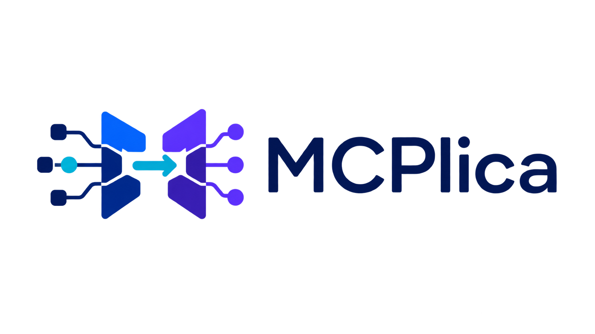
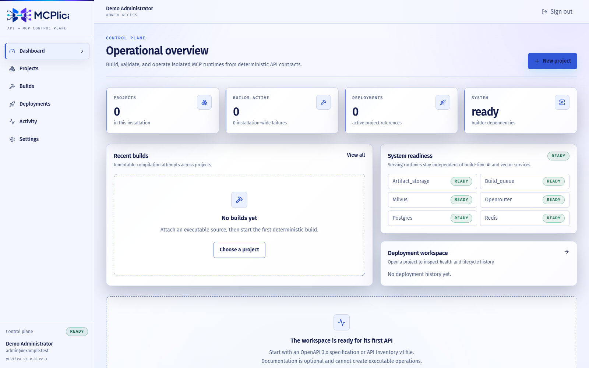

# MCPlica

<p align="center">
  
</p>

<p align="center">
  <strong>Turn an API description into a secure, self-hosted MCP server.</strong>
</p>

MCPlica guides you from an OpenAPI specification or API inventory to a reviewed MCP manifest and
an isolated project runtime. It combines deterministic compilation with optional AI-assisted
analysis, so teams can understand, build, validate, and operate MCP integrations from one place.

> **Prerelease:** this branch is prepared as `v1.0.0-rc.1`. It is suitable for evaluation, not a
> claim of production certification. See the [release notes](docs/releases/v1.0.0-rc.1.md) for
> compatibility and known limitations.



## What you can do

- Import an OpenAPI document or structured API inventory.
- Review detected operations, authentication needs, and generated tool definitions.
- Build and validate a reproducible MCP manifest with clear provenance.
- Deploy each project through its own isolated, reusable MCP runtime.
- Operate projects, builds, deployments, credentials, and audit history from the web interface.

## Try it locally

You need Docker Engine with Docker Compose 2.24.4 or newer and Python 3.13. From the repository
root:

```bash
python scripts/init_env.py
docker compose --env-file .env -f infra/compose.yaml up --build --detach --wait --wait-timeout 300
docker compose --env-file .env -f infra/compose.yaml exec -T api python -m app.cli.ensure_development_admin
```

The initializer creates a private `.env` with random local secrets and development administrator
credentials. Do not commit or paste that file into logs. Then open:

- Web interface: <http://localhost:8080>
- API documentation: <http://localhost:8000/docs>
- API health: <http://localhost:8000/api/v1/health>

Stop the local stack without deleting its data:

```bash
docker compose --env-file .env -f infra/compose.yaml down
```

For configuration, upgrades, production TLS, backups, troubleshooting, and safe data-lifecycle
commands, follow the [installation and operations guide](docs/operations/installation.md).

## Learn more

- [User guide](docs/user-guide.md) — the end-to-end product journey.
- [Project overview](docs/project-overview.md) — scope, architecture boundaries, implemented
  capabilities, and repository map.
- [Development guide](docs/development.md) — host development and verification without the full
  Compose stack.
- [API guide](docs/api.md) — authentication, requests, responses, and contract evolution.
- [Documentation index](docs/README.md) — architecture, operations, security, and maintainer docs.
- [Contributing](CONTRIBUTING.md) — development workflow and contribution requirements.

## License and community

MCPlica is licensed under the [GNU Affero General Public License v3.0](LICENSE). External code
contributions require the project [CLA](CLA.md); the project does not use DCO sign-off.

Security reports belong in the private channel described in [SECURITY.md](SECURITY.md). For usage
help, see [SUPPORT.md](SUPPORT.md).
